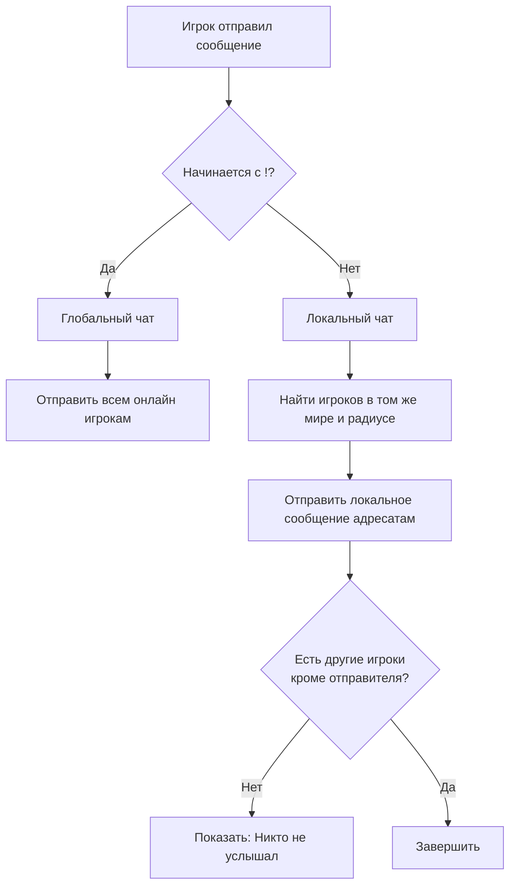

<div align="center">

# ChatGL-MC

[](https://www.minecraft.net/)
[](https://papermc.io/)
[](https://openjdk.org/)
[](./LICENSE)

Простой и надежный плагин для **разделения чата на локальный и глобальный**.

</div>

---

## ✨ Возможности

- **Локальный чат** по умолчанию (сообщение видят игроки в радиусе `50` блоков).
- **Глобальный чат** через префикс `!` (сообщение видит весь сервер).
- Сообщение игроку, если его **никто не услышал** в локальном чате.
- Гибкая настройка через `config.yml`:
  - радиус локального чата;
  - префикс глобального чата;
  - форматы сообщений;
  - текст уведомления о том, что рядом никого нет.

---

## 🧠 Как это работает

### Логика маршрутизации сообщений

1. Игрок отправляет сообщение в чат.
2. Плагин перехватывает событие `AsyncChatEvent`.
3. Если сообщение начинается с `!`, оно отправляется в **глобальный** канал.
4. Если `!` нет — сообщение отправляется в **локальный** канал в пределах радиуса.
5. Если в локальном радиусе нет других игроков, отправителю показывается:
   > `Вас никто не услышал, нет игроков в радиусе 50м.`

### Схема работы



---

## 📦 Установка

1. Скачайте/соберите `.jar` плагина.
2. Поместите файл в папку `plugins/` вашего Paper-сервера.
3. Перезапустите сервер.
4. При первом запуске будет создан `plugins/ChatGL/config.yml`.

---

## ⚙️ Конфигурация

```yaml
chat:
  local-radius: 50
  global-prefix: "!"

  formats:
    local: "<gray>[L]</gray> <white>%player%</white>: <yellow>%message%</yellow>"
    global: "<gold>[G]</gold> <white>%player%</white>: <white>%message%</white>"

  messages:
    no-listeners: "<red>Вас никто не услышал, нет игроков в радиусе %radius%м.</red>"
```

### Пояснения

- `local-radius` — дальность локального чата в блоках.
- `global-prefix` — символ/строка для отправки в глобальный чат.
- `formats.local`, `formats.global` — шаблоны сообщений (MiniMessage).
- `messages.no-listeners` — уведомление, если рядом никого нет.

---

## 🛠️ Сборка из исходников

```bash
mvn clean package
```

Готовый артефакт будет в папке `target/`.

---

## 👤 Автор

**nestren**

---

## 📄 Лицензия

Проект распространяется по лицензии **Apache 2.0**. Подробности в [LICENSE](./LICENSE).
